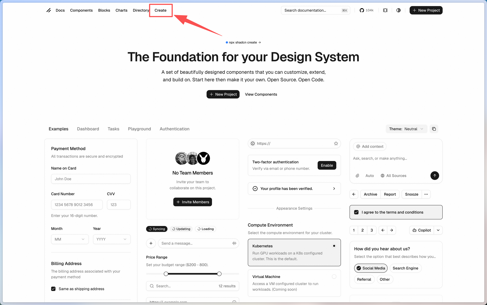
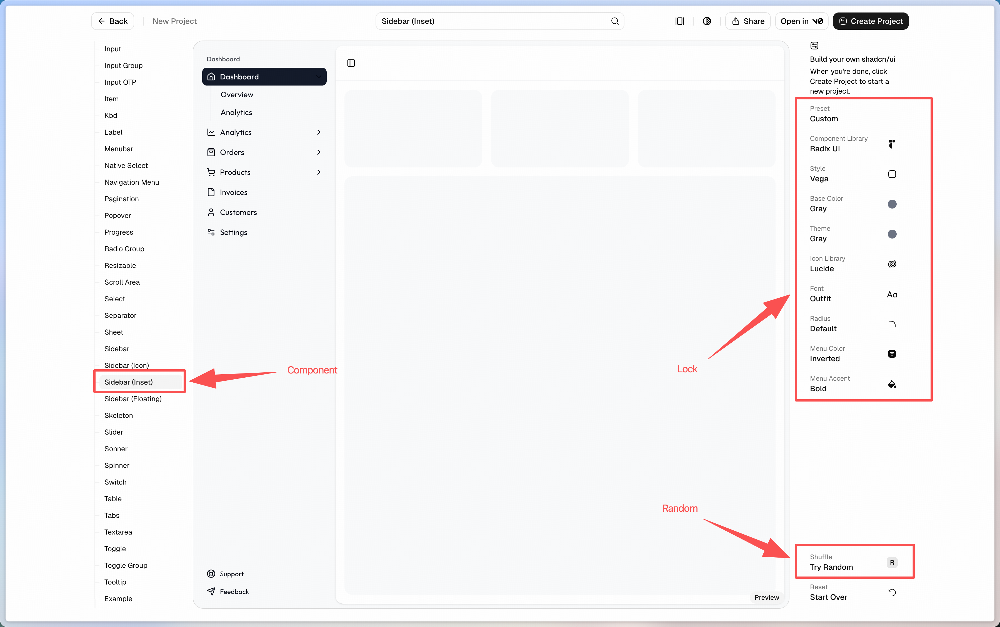
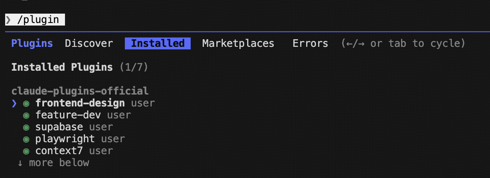
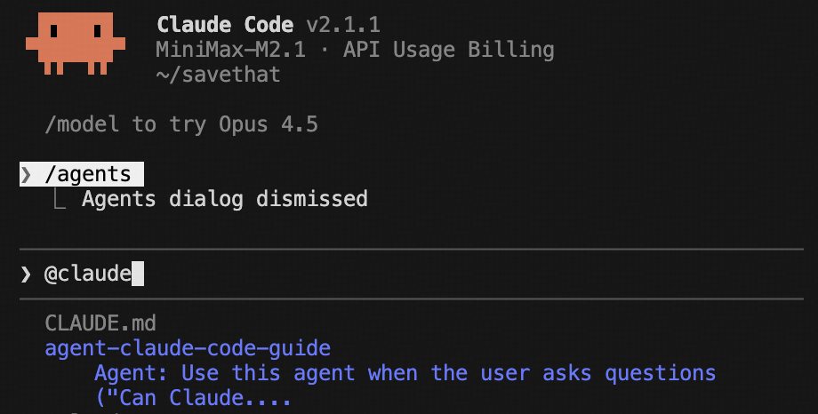

# 如何使用 claude code

## 基础信息

- claude 版本：v2.1.1
- 使用模型：minimax-m2.1

## 适用人群

由于这套 skill 专注于开发流程，所以适合：

- vibe coder
- 开发者
- 产品经理

---

## 第一步：创建一个项目

**推荐框架：Next.js 16**

推荐原因很简单：

- 生态完善：vercel、ai-sdk、v0 师出同门
- 在 vercel 部署非常方便，起步阶段可以免费部署
- 全栈支持良好

> 确定框架后，claude code 干活儿更规范，不会在 codebase 内乱搞。

### 安装方式

推荐在 <https://ui.shadcn.com/create> 直接获取一个自己喜欢的风格主题。

**操作步骤：**

1. 访问 <https://ui.shadcn.com/>

2. 找到导航栏中的「Create」，点击进去

   

3. 左侧边栏往下滑动，找到 **sidebar**，挑一个自己喜欢的主题
   - 右下角可以随机获取一个主题
   - 如果恰好随机到自己喜欢的，可以在右侧边栏把特定元素锁定
   - sidebar 模式中包含的可复用 ui 组件足够多，前期 vibe 够用了

   

4. 选好后点击「Create Project」，复制命令即可

---

## 第二步：初始化 claude code

把当前 codebase 架构记录到 claude 的 memory 中，方便后续开发。

**操作方式：** 进入 claude code，直接输入 `/init` 然后回车，claude code 会自己初始化 memory。

> 💡 **Tips:** 可以弄个 commands 命令，把更新 claude memory 的逻辑封装起来，方便使用。

---

## 第三步：熟悉 .claude 内容

所有 claude code 的配置都放在 `.claude` 目录下：

| 类型 | 用途 | 说明 |
|------|------|------|
| **agents** | 任务执行 | 负责执行具体的任务，比如代码 review、代码简化、代码优化等 |
| **commands** | 快捷命令 | 类似于快捷键，本质上是 markdown 文件，包含命令描述、使用方式、使用场景 |
| **hooks** | 自动化工具 | 核心 3 个逻辑：preToolUse（在工具使用前）、postToolUse（在工具使用后）、stop（在任务完成时） |
| **plans** | 计划存档 | plan mode 下生成的内容，可以自然语言命令 claude code 在这里存档，方便回溯 |
| **skills** | 自动化流程 | 将 agent、mcp、command 等动作串成完整流程，使用时通过自然语言触发即可 |
| **settings** | 配置管理 | 设置 claude code 的配置 |

**理解要点：**

- skill 是将所有动作串联起来的全局系统
- agent、commands、hooks 等是具体的工具和动作单元
- 需要新增配置时，直接在 claude code 中输入需求，claude code 会自己分析并执行

---

## 第四步：安装 plugin

输入 `/plugin` 回车，然后选择要安装的 plugin。

**推荐安装这几个，够用很久：**

- **frontend-design user** - UI 设计助手
- **feature-dev user** - 功能开发助手
- **supabase user** - supabase 数据库助手
- **playwright user** - playwright 测试助手
- **context7** - 文档助手（强烈推荐）

---

## 第五步：开始干活儿

先用 **plan mode** 讨论需求，规划 plan，然后再正式动工。

---

## 进阶：创建自己的 skill

使用 `@claude-code-guide` 创建自己的 skill。

这是官方内置的 claude code 指南，在创建 skill、hooks 时可以让 claude code 自行参考。在遇到任何自己不知道如何操作的问题时，把这个指南 @ 出来直接问就行。

---

> 持续更新中...
