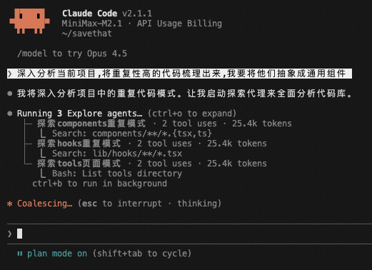
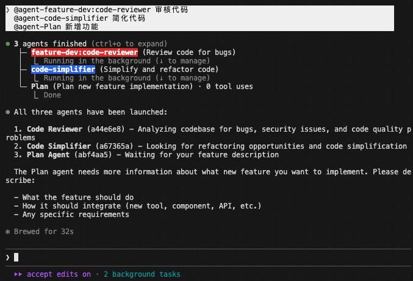

# 如何使用 claude code

我也在摸索中，属于抛砖引玉了，欢迎一起讨论，文档会持续更新。

目录：

- [基础信息](#基础信息)
- [适用人群](#适用人群)
- [第一步：创建一个项目](#第一步创建一个项目)
- [第二步：初始化 claude](#第二步初始化-claude)
- [第三步：熟悉 .claude 内容](#第三步熟悉-claude-内容)
- [第四步：安装 plugin](#第四步安装-plugin)
- [第五步：开始干活儿](#第五步开始干活儿)
- [进阶：创建自己的 skill](#进阶创建自己的-skill)
- [常见问题 Q\&A](#常见问题-qa)

---

## 基础信息

- claude 版本：v2.1.1
- 使用模型：MINIMAX-M2.1

> 💡 **小贴士**: 按 `Cmd+K` (Mac) 或 `Ctrl+K` (Windows) 可以快速调出对话输入框，养成这个习惯后效率提升明显。

---

## 适用人群

由于这套 skill 专注于开发流程，所以适合：

- vibe coder
- 开发者
- 产品经理

---

## 第一步：创建一个项目

**推荐框架：Next.js 16**

推荐原因很简单：

- 生态完善：vercel、ai-sdk、v0 师出同门
- 在 vercel 部署非常方便，起步阶段可以免费部署
- 全栈支持良好

> 📌 **划重点**: 确定框架后，claude code 干活儿更规范，不会在 codebase 内乱搞。框架就是项目的"宪法"，定下来大家都老实。

### 安装方式

推荐在 <https://ui.shadcn.com/create> 直接获取一个自己喜欢的风格主题。

**操作步骤：**

1. 访问 <https://ui.shadcn.com/>

2. 找到导航栏中的「Create」，点击进去

   

3. 左侧边栏往下滑动，找到 **sidebar**，挑一个自己喜欢的主题
   - 右下角可以随机获取一个主题
   - 如果恰好随机到自己喜欢的，可以在右侧边栏把特定元素锁定
   - sidebar 模式中包含的可复用 ui 组件足够多，前期 vibe 够用了

   

4. 选好后点击「Create Project」，复制命令即可

---

## 第二步：初始化 claude code

把当前 codebase 架构记录到 claude 的 memory 中，方便后续开发。

**操作方式：** 进入 claude code，直接输入 `/init` 然后回车，claude code 会自己初始化 memory。

> 💡 **Tips:** 强烈建议弄个 commands 命令，把更新 claude memory 的逻辑封装起来。我自己用的是 `/update-memory`，每次大改动后都会执行一下，相当于给 claude 同步最新认知。

---

## 第三步：熟悉 .claude 内容

所有 claude code 的配置都放在 `.claude` 目录下：

| 类型 | 用途 | 说明 |
|------|------|------|
| **agents** | 任务执行 | 负责执行具体的任务，比如代码 review、代码简化、代码优化等 |
| **commands** | 快捷命令 | 类似于快捷键，本质上是 markdown 文件，包含命令描述、使用方式、使用场景 |
| **hooks** | 自动化工具 | 核心 3 个逻辑：preToolUse（在工具使用前）、postToolUse（在工具使用后）、stop（在任务完成时） |
| **plans** | 计划存档 | plan mode 下生成的内容，可以自然语言命令 claude code 在这里存档，方便回溯 |
| **skills** | 自动化流程 | 将 agent、mcp、command 等动作串成完整流程，使用时通过自然语言触发即可 |
| **settings** | 配置管理 | 设置 claude code 的配置 |

**理解要点（来自官方指南）：**

- skill 是将所有动作串联起来的全局系统
- agent、commands、hooks 等是具体的工具和动作单元
- 需要新增配置时，直接在 claude code 中输入需求，claude code 会自己分析并执行
- **遇到不确定的事情，直接问，别憋着** - claude code 遇到不确定的会主动寻求澄清

---

## 第四步：安装 plugin

输入 `/plugin` 回车，然后选择要安装的 plugin。

**推荐安装这几个，够用很久：**

- **frontend-design user** - UI 设计助手
- **feature-dev user** - 功能开发助手
- **supabase user** - supabase 数据库助手
- **playwright user** - playwright 测试助手
- **context7** - 文档助手（强烈推荐）
- **context7 MCP** - 查询任意库的官方文档


> 💡 **建议**: 先装 context7，遇到不会的库直接让它查文档，比搜索引擎快多了。

---

## 第五步：开始干活儿

这一章是核心中的核心，我用了很多次才摸索出这套打法。分享一下我的工作流。

### 1. 先 plan，再动手

**plan mode 是 claude code 的精髓所在。**

它的好处在于：会并行启动多个 Explore agent 对整个项目进行探索，然后再生成 plan。这意味着它不是盲目干活，而是先理解项目结构、现有模式、代码风格后再动手。

**我的使用习惯：**

1. 复杂需求先开 plan mode
2. 直接说清楚你的需求，比如："深入分析项目，将重复代码抽象成通用组件"
3. claude code 会自动探索代码库，生成详细计划
4. 计划生成后，仔细看一下，有问题就让它改
5. 确认无误后，说"将 plan 保存到 plans 目录下"，然后退出 plan mode 开始执行



**什么时候用 plan mode：**

| 场景 | 推荐 |
|------|------|
| 新功能开发，涉及多个文件 | ✅ 用 |
| 重构、抽象组件 | ✅ 用 |
| 修复复杂 bug | ✅ 用 |
| 改个 typo | ❌ 不用 |
| 简单代码优化 | ❌ 不用 |

> 📌 **来自官方指南**: "主动规划、预测问题并提前解决" - plan mode 就是干这个的。

### 2. 工具箱说明书

claude code 最重要的三个组件：command、agent、skill。它们各有分工，用对了效率翻倍。

#### Command - 快捷键

**本质**: 预设好的快捷键，触发后执行一系列动作

**触发方式**: `/ + 命令名` 或者自然语言描述后让 claude code 自己匹配

**使用场景**:

- 固定流程：比如代码 review、生成 commit message
- 频繁操作：封装成 command 一步到位

#### Agent - 子代理

**本质**: 有独立上下文的子代理，不占主代理的会话

**触发方式**: "我的目的 + @ + agent 名称"

**使用场景**:

- 并行任务：让多个 agent 同时干活
- 探索分析：让 agent 去分析代码库
- 代码审查：让 agent 去 review 代码

**优势**: 节省主代理上下文空间



#### Skill - 自动化流程

**本质**: 将 agent、mcp、command 串起来的完整 SOP

**触发方式**: "我的目的 + @ + skill 名称"

**使用场景**:

- 复杂流程：需要多个步骤配合的
- 团队 SOP：统一的开发流程
- 质量保障：自动化测试+review+提交

**command vs agent vs skill 对比：**

| 特性 | Command | Agent | Skill |
|------|---------|-------|-------|
| 上下文 | 主会话 | 独立 | 主会话 |
| 并行 | ❌ | ✅ | ❌ |
| 复杂度 | 低 | 中 | 高 |
| 触发速度 | 快 | 中 | 慢 |

> 💡 **我的习惯**: 常用的 skill 封装成 command，用起来最快。比如我的 `/review-code` 就是调用了 nextjs-code-reviewer 这个 skill。

### 3. 实战工作流

分享一个完整的开发流程，从需求到上线。

**案例需求**: "给项目添加一个通用的错误展示组件"

**Step 1: 需求分析（5分钟）**

```
我: "帮我分析项目中重复使用的组件，找出可以抽象成通用组件的地方"
claude code: (探索代码库，返回分析结果)
```

**Step 2: Plan Mode（10分钟）**

```
我: "基于分析结果，创建一个通用的组件库"
-> 计划生成
-> 保存计划
-> 开始执行
```

**Step 3: 编码实现（30分钟）**

```
claude code: (创建组件，修改引用文件)
```

**Step 4: 代码审查（5分钟）**

```
我: "@nextjs-code-reviewer 审核刚才的改动"
claude code: (返回 review 结果)
```

**Step 5: 提交代码（5分钟）**

```
我: "@git-committer 提交代码"
claude code: (自动生成 commit message 并提交)
```

> 💡 **Tip**: 我一般会在编码前先问一句"这个改动会影响哪些文件"，让 claude code 先列出来，心里有底。

### 4. 避坑指南

这些都是我踩过的坑。

| 常见错误                   | 后果                                    | 推荐做法                                                          | 示例/补充                                                         |
|---------------------------|----------------------------------------|-------------------------------------------------------------------|-------------------------------------------------------------------|
| 不做 plan 直接让 ai 动手   | 代码风格不统一、违反项目规范、重复代码   | 复杂需求先走 plan mode，让 ai 理解结构后再动手                     | -                                                                 |
| 需求描述太模糊             | ai 理解偏差，结果需重写                  | 需求分点说明，必要时给示例                                         | 错误: “做个登录页面” <br> 正确: “做个登录页面，需要：1) 邮箱密码登录 2) 记住我功能 3) 忘记密码链接 4) 参考现有的登录页风格” |
| 不做验证直接合并           | 代码质量、规范存在风险                  | 使用 nextjs-code-reviewer skill 审查代码                           | -                                                                 |
| 过度设计                   | 代码复杂，维护成本高                    | 遵循官方原则：“Simple over clever”                                 | 错误: “为了防止将来可能需求，先做个通用配置系统” <br> 正确: “先实现当前需求，需要扩展时再重构” |
| 重复造轮子                 | 代码冗余，维护困难                      | 先检查项目中是否已有类似实现                                       | “帮我做一个下拉选择器” → “等下，我看看项目中有没有现成的”         |

### 5. 高阶玩法：让 ai 越来越懂你

claude code 有记忆功能，用好这个可以大幅提升效率。

**方法 1：主动更新 CLAUDE.md**

CLAUDE.md 是项目的"宪法"，记录了：

- 项目架构
- 代码规范
- 常用模式
- 组件复用规则

每次发现有用的 pattern，就让 claude code 更新进去：

```
"梳理我们刚才的开发过程，将 ErrorDisplay 组件的使用方式记录到 CLAUDE.md 中"
```

**方法 2：用好 memory**

claude code 有两种记忆：

- 项目记忆：将每一个通过的 plan 结果存档到 plans 目录下，方便回溯
- 会话记忆：将对话梳理出关键信息，存储到 CLAUDE.md 中

项目记忆要定期维护，会话记忆要善于利用。

**方法 3：建立团队 SOP**

把团队的规范固化成 skill：

- 代码风格检查 → command
- 测试流程 → skill
- 发布流程 → skill

团队成员用同一套 SOP，代码质量自然稳定。

---

## 进阶：创建自己的 skill

### 为什么要创建 skill？

当你的工作流需要多个 agent、command 配合完成时，skill 就派上用场了。

**适用场景：**

- 固定流程：每次开发都要走的流程
- 团队规范：统一的质量检查流程
- 复杂任务：需要多步骤配合

### 创建步骤

**Step 1: 准备材料**

你需要：

- skill 名称
- 描述（做什么的）
- agent/mcp/command 列表
- 执行顺序

**Step 2: 编写 skill 配置**

在 `.claude/skills/` 目录下创建 skill 文件。

**Step 3: 测试优化**

多跑几次，调整到满意的流程。

### 使用 @claude-code-guide

遇到不会的操作，直接问官方指南：

```
"怎么创建一个自定义的 hook @claude-code-guide"
```

这是官方内置的 claude code 指南，在创建 hooks 时可以让 claude code 自行参考。


---
> 📌 **持续更新中...**
